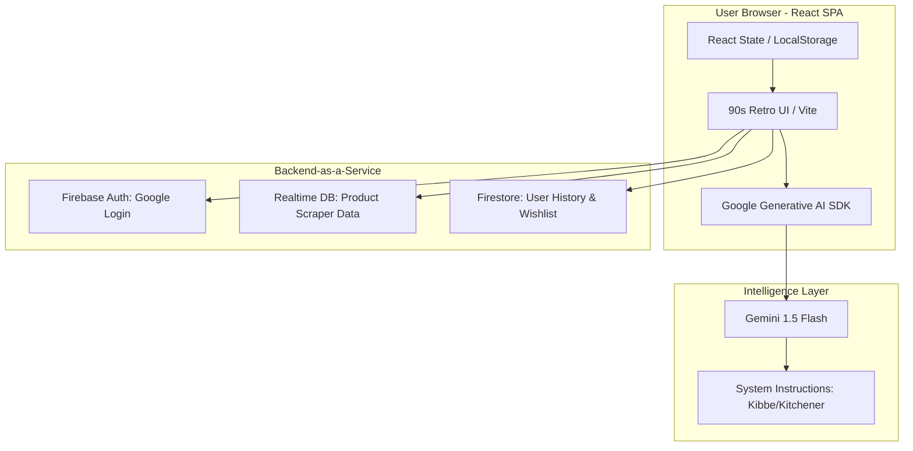
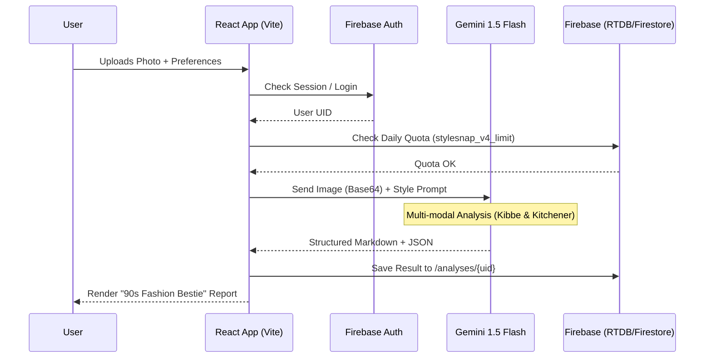
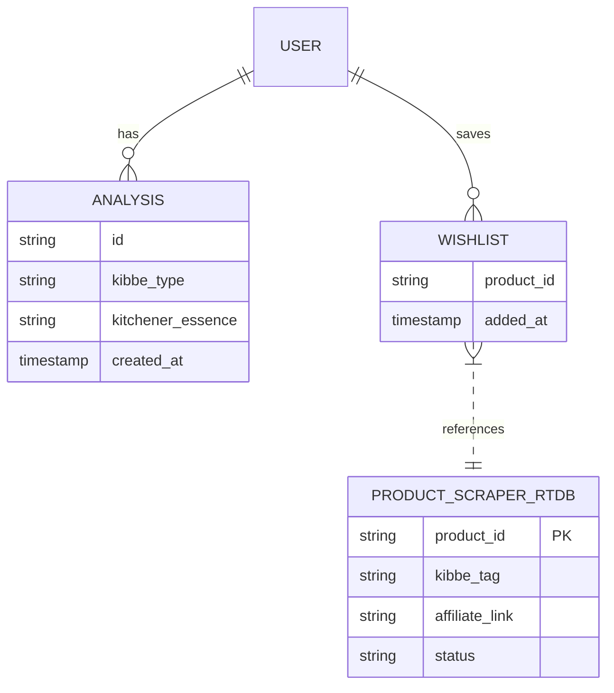

# StyleSnap AI 📸✨

**Live Demo:** [stylesnapai.netlify.app](https://stylesnapai.netlify.app)

StyleSnap AI is a professional-grade fashion analysis tool that uses AI to help users discover their **Kibbe Body Type** and **Kitchener Essence**. Built with a retro Y2K aesthetic, it combines cutting-edge multimodal AI with a nostalgic interface.

---

## 🏗️ High-Level Design (HLD)

### System Architecture
StyleSnap AI follows a **Client-Serverless** architecture:



- **Frontend:** React (Vite) Single Page Application (SPA).
- **AI Engine:** Google Gemini 1.5 Flash (Multimodal LLM).
- **Backend-as-a-Service (BaaS):** Firebase (Auth, Firestore, Realtime Database).
- **Monetization:** Integrated Google AdSense for ad delivery.

### Data Flow
The following sequence diagram illustrates the step-by-step logic when a user clicks "Analyze My Style":



1. **Ingestion:** User uploads an image via the browser.
2. **Processing:** The image is converted to base64 and dispatched to the Gemini API via the `@google/genai` SDK.
3. **Reasoning:** Gemini analyzes the image against a specialized "Stylist Knowledge Base" prompt.
4. **Delivery:** The structured Markdown response is streamed back to the UI.
5. **Persistence:** Analysis metadata is synced to Firestore; usage quotas are tracked in the Realtime Database.

---

## 💻 Low-Level Design (LLD)

### 1. Core Application Logic (`App.tsx`)
The application is built as a state-driven machine using React Hooks:
- **State Management:** Uses `useState` for UI state (tabs, modals, loading) and `useEffect` for lifecycle events (Auth state, rate limit resets).
- **Rate Limiting:** Implements a sliding window algorithm. It checks the `stylesnap_v4_limit` in `localStorage` and cross-references with Firebase RTDB to prevent multi-device quota bypassing.
- **Error Handling:** A custom `handleFirestoreError` wrapper ensures that permission issues or quota errors are logged as structured JSON for easier debugging.

### 2. AI Integration Layer
- **Model:** `gemini-1.5-flash`
- **Configuration:** 
  - `temperature: 0.7` for a balance of creative styling and technical accuracy.
  - `systemInstruction`: A 500+ word prompt defining the Kibbe/Kitchener framework.
- **Multimodal Handling:** Images are processed as `inlineData` parts alongside text prompts.

### 3. Database Schema (Firestore & RTDB)
This maps out how Firestore (User data) and Realtime Database (Scraped products) relate to each other:



- **`users/{uid}`**: Stores profile info and scan history.
- **`wishlist/{itemId}`**: Stores products saved from the "Shop" tab.
- **`analyses/{analysisId}`**: Stores historical AI outputs for user retrieval.

### 4. UI/UX Design System
- **Styling:** Tailwind CSS with a custom `@theme` configuration.
- **Aesthetic:** "Barbie-core" meets "Windows 98".
- **Components:**
  - `RetroWindow`: A container with a title bar and "X" button.
  - `RetroButton`: High-contrast, shadowed buttons with active "pressed" states.
  - `AnimatePresence`: Handles smooth unmounting of retro modals.

---

## 🛠️ Tech Stack

- **Frontend:** React 19, TypeScript, Vite.
- **Styling:** Tailwind CSS 4, Lucide Icons.
- **Animation:** Motion (Framer Motion).
- **AI:** Google Gemini SDK (`@google/genai`).
- **Backend:** Firebase (Auth, Firestore, RTDB).
- **Markdown:** `react-markdown` with GFM support.

---

## 🚀 Getting Started

1. **Clone the repo**
2. **Install dependencies:**
   ```bash
   npm install
   ```
3. **Environment Variables:**
   Create a `.env` file with:
   - `GEMINI_API_KEY`: Your Google AI Studio key.
   - Firebase config variables.
4. **Run Development Server:**
   ```bash
   npm run dev
   ```

---

## 📜 License & Terms
This project is licensed under the **StyleSnap AI Terms of Service**. See `TERMS_OF_SERVICE.EXE` in the app for details.
